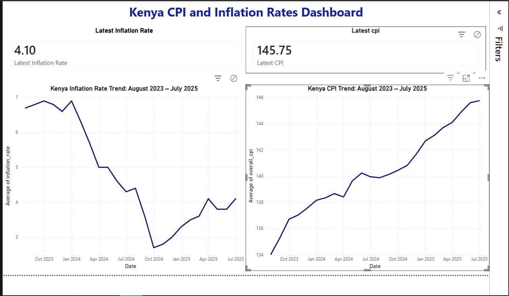

# Kenya CPI Data Extraction Project

Extracts Consumer Price Index (CPI) and inflation rate data from monthly KNBS 
(Kenya National Bureau of Statistics) PDF reports, covering August 2023 to July 2025.

## What it does
- Parses 10+ official KNBS PDF reports using `pdfplumber` and regex
- Handles inconsistent report formats across months (some reports use plain 
  tables, others use chart-based layouts requiring derived calculations)
- Deduplicates overlapping historical data across reports
- Outputs a clean, analysis-ready CSV dataset

## Key challenge solved
Two months (June and July 2025) presented their historical CPI trend data as 
charts rather than tables, making direct extraction unreliable. Instead of 
parsing chart pixel data, the pipeline calculates these values using the 
month-on-month percentage change published in each report's text-based 
summary table, chained from the last known reliable CPI value.

## Tech stack
Python, pandas, pdfplumber, regex

## Output
`data/processed/overall_cpi_inflation_clean.csv` — 24 months of clean, 
deduplicated CPI and inflation data.

## Author
Kesiah Nyaruai Nderitu
## Dashboard Preview
